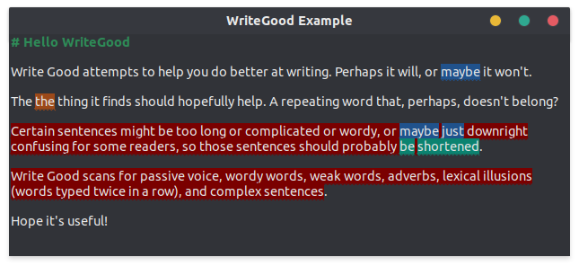

# libwritegood

A port of [write good](https://github.com/btford/write-good), [3 shell scripts to improve your writing, or "My Ph.D. advisor rewrote himself in bash."](http://matt.might.net/articles/shell-scripts-for-passive-voice-weasel-words-duplicates), and [How I reverse-engineered the Hemingway Editor - a popular writing app - and built my own from a beach in Thailand](https://www.freecodecamp.org/news/https-medium-com-samwcoding-deconstructing-the-hemingway-app-8098e22d878d) for Gtk TextView.



## Languages

Currently, we have:

```
en_US
```

## Requirements

### Ubuntu

```
meson
ninja-build
valac
cmake
libgtk-4-dev
```

### Fedora

```
vala
meson
ninja-build
cmake
gtk4-devel
```

## Usage

If your build system is meson, we recommend using [the wrap depenency system](https://mesonbuild.com/Wrap-dependency-system-manual.html)

###  libwritegood.wrap
```
[wrap-git]
directory=libwritegood
url=https://github.com/ThiefMD/libwritegood-vala.git
revision=master
```

Place the `libwritegood.wrap` in subprojects directory in your project.

In your meson.build, add:

```
writegood_dep = dependency('writegood-0.1', fallback : [ 'writegood', 'libwritegood_dep' ])
```

Then add writegood_dep to your dependencies.

### Attaching to your TextView

This example is with GtkSource.View, but a Gtk.TextView will also work.

```vala
var manager = GtkSource.LanguageManager.get_default ();
var language = manager.guess_language (null, "text/markdown");
var view = new GtkSource.View ();
buffer = new GtkSource.Buffer.with_language (language);
buffer.highlight_syntax = true;
view.set_buffer (buffer);
view.set_wrap_mode (Gtk.WrapMode.WORD);

//
// Enable write-good
//

checker = new WriteGood.Checker ();
checker.set_language ("en_US");
checker.attach (view);

//
// Quick check only scans around the last check cursor position, and
// and the current cursor position
//
buffer.changed.connect (() => {
    checker.quick_check ();
});

//
// Recheck all will scan the entire document
//
buffer.paste_done.connect ((clipboard) => {
    checker.recheck_all ();
});
```

### Building Examples

After running `meson build` inside of the build directory run `meson configure -Denable_examples=true`. This will build the hello-writegood app that can be used for testing.
